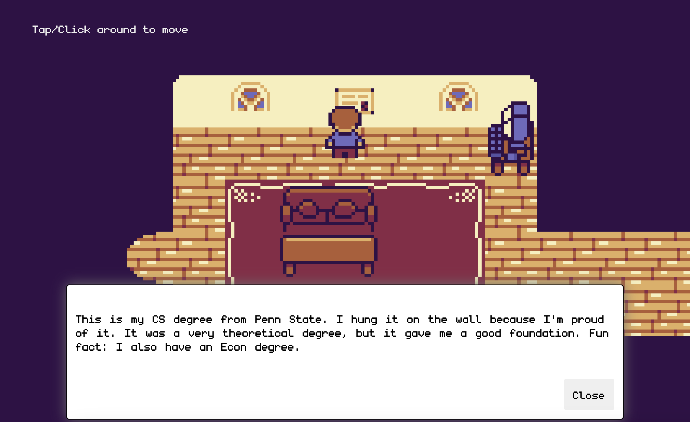
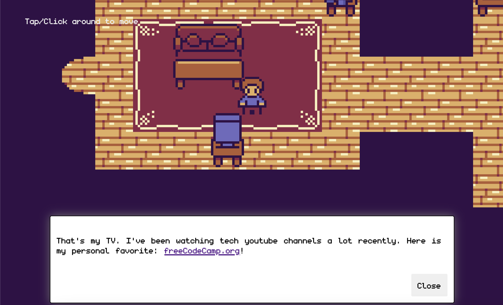
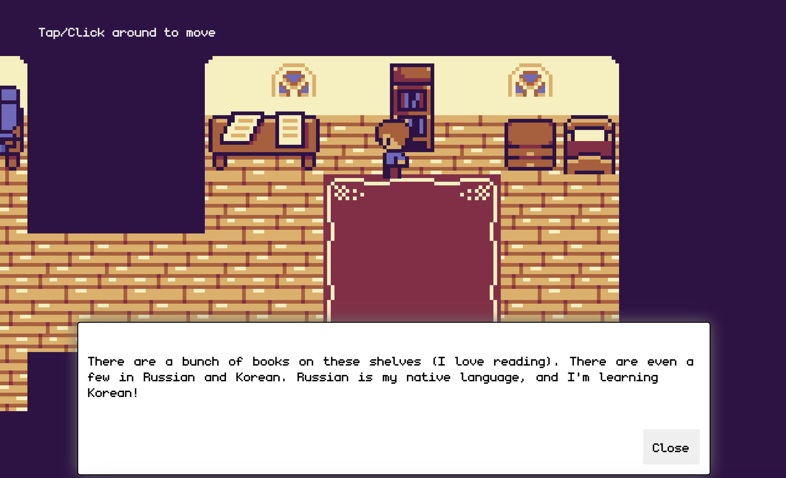

# 2D Adventure Game Portfolio Project

## Overview

This 2D adventure game was built using the Kaboom.js framework, which is often used in game development. The project features character movement, dialogue systems, map navigation, and collision detection.

## Features

### Core Gameplay

- 🕹️ **Character Movement** with 8-directional animations
- 🗺️ **Tile-based Map System** loaded from JSON
- 🚧 **Collision Detection** with environment boundaries
- 💬 **Interactive Dialogue System** triggered by collisions

### Technical Highlights

- 🖼️ **Sprite Animation** with multiple character states
- 🎮 **Mouse-based Movement** with pathfinding
- 📷 **Dynamic Camera** that follows the player
- 📱 **Responsive Scaling** for different screen sizes

## Technologies

- **Kaboom.js** - Game development framework
- **JavaScript ES6+** - Core programming language
- **Tiled Map Editor** - For creating game maps (map.json)
- **Webpack** - Module bundling (if applicable)

## Game Mechanics

### Character Control

- Click anywhere to move the character
- Automatic animation transitions between:
  - Idle (up/down/side)
  - Walk (up/down/side)
- Character faces movement direction

### World System

- Map loaded from external JSON file
- Collision boundaries defined in map layers
- Dialogue triggers on specific collisions

### Camera System

- Smooth camera follow
- Automatic scaling for different resolutions
- Responsive to window resizing

### Asset Specifications

- **Animations**:
  - Walk cycles (up/down/side)
  - Idle states (up/down/side)
- **Map**: JSON format exported from Tiled
