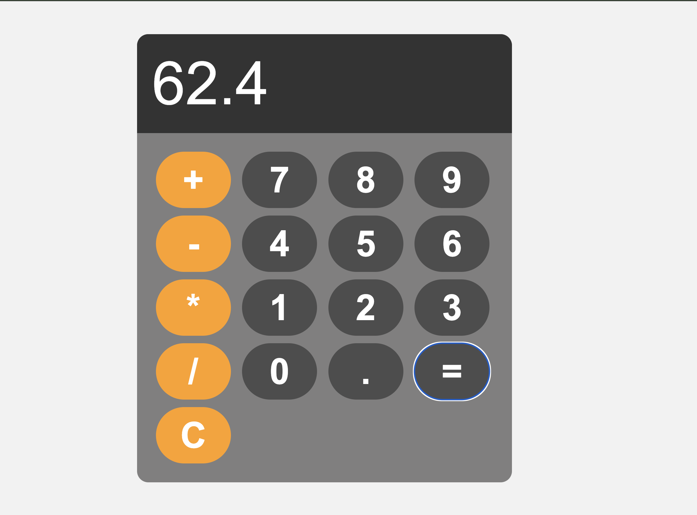

# Calculator Project

This is a simple web-based calculator built using **HTML**, **CSS**, and **JavaScript**. It performs basic arithmetic operations such as addition, subtraction, multiplication, and division. It also includes functionalities like clearing the display and evaluating expressions.

## Features

- **Basic Arithmetic Operations**: Addition, subtraction, multiplication, and division.
- **Clear Button**: Clears the input display.
- **Error Handling**: Displays "Error" if there’s a syntax error or invalid operation.
- **Responsive Interface**: The calculator is built to be user-friendly and responsive.

## Project Demo

Here are screenshots of the project in action:

