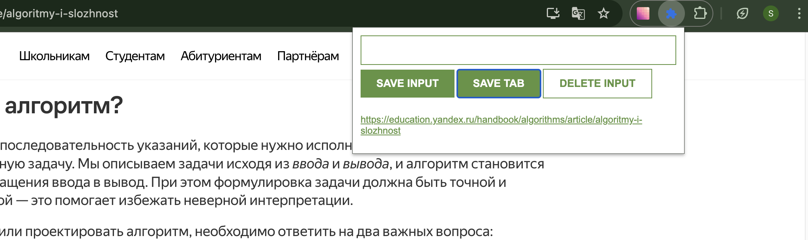

# Chrome Extension: Save and Manage Links

## Overview

This Chrome extension allows users to save and manage links, either by entering them manually or by saving the current active tab. Users can also delete saved links and persist their data using localStorage.

## Features

- **Save Input**: Manually enter a URL and save it.
- **Save Tab**: Save the current active tab's URL.
- **Delete Input**: Clear all saved URLs by double-clicking.
- **Persistent Storage**: Saves data in `localStorage` to retain links after closing the browser.

## Usage

1. Open the extension popup.
2. Enter a URL in the input field and click **SAVE INPUT** to store it.
3. Click **SAVE TAB** to save the currently open tab’s URL.
4. Click **DELETE INPUT** (double-click required) to clear all saved links.
5. Saved links appear as a clickable list.
ch
## Screenshot

Here's a screenshot of the Chrome Extension:

