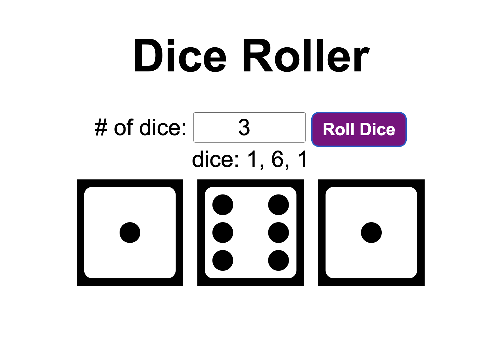

# 🎲 Dice Roller

A simple web-based dice roller that allows users to roll multiple dice and view the results as text and images.

## Features

✅ Roll 1 or more dice at once  
✅ Displays both numerical results and dice images  
✅ Randomized dice rolls using `Math.random()`  
✅ Simple and clean UI

## How It Works

- Users enter the number of dice to roll in the input field.
- Clicking the "Roll Dice" button triggers the `rollDice()` function.
- The function generates random numbers (1-6) for each die and updates:
  - A text-based result displaying rolled values.
  - Dice images corresponding to the rolled values.

## Screenshot

