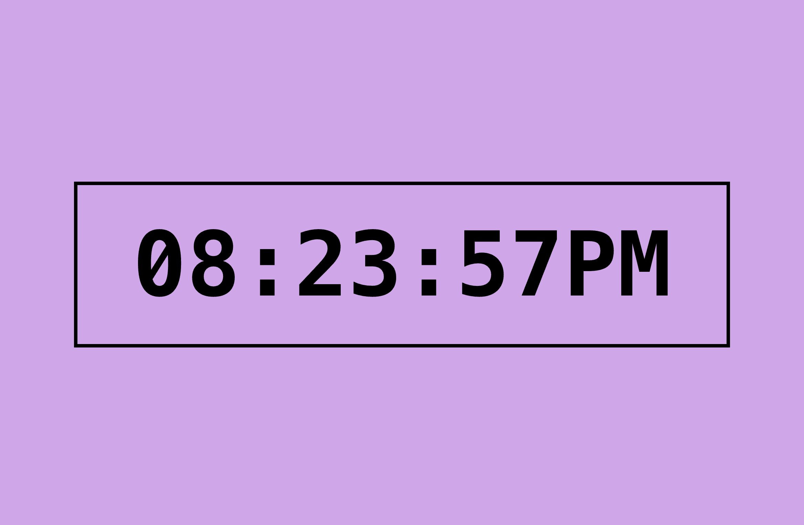

# Digital Clock

A simple digital clock that displays the current time in a 12-hour format with AM/PM indication. The clock updates every second.

## Features

✅ 12-hour format with AM/PM  
✅ Auto-updates every second  
✅ Zero-padded hours, minutes, and seconds for consistency

## How It Works

- The `updateClock` function retrieves the current time using `Date()`.
- It converts the 24-hour format to a 12-hour format.
- The time is displayed as `HH:MM:SS AM/PM`.
- The clock updates every second using `setInterval(updateClock, 1000)`.

## Screenshot

