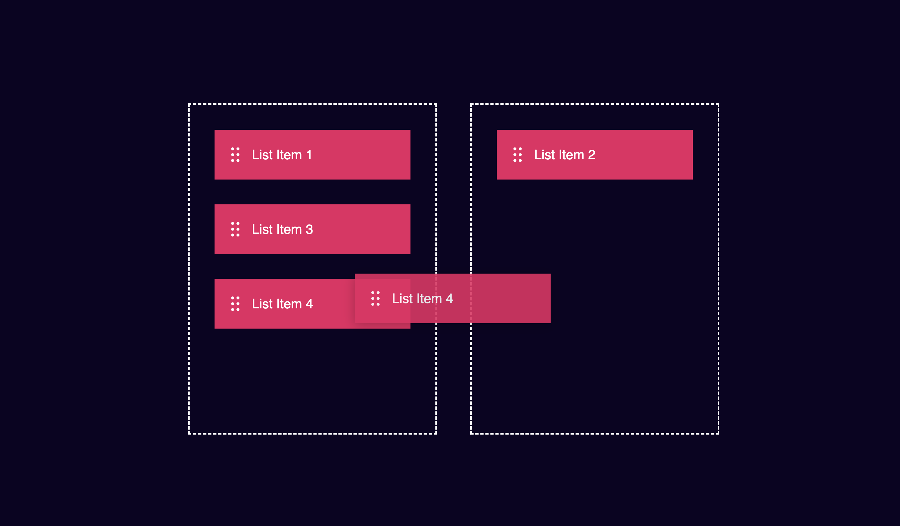

# Drag&Drop Functionality

This project demonstrates a simple drag-and-drop functionality implemented with HTML, CSS, and JavaScript. It allows list items to be dragged from one container (the left box) and dropped into another container (the right box), and vice versa.

## Features

- Drag and drop list items between two sections.
- Uses vanilla JavaScript for handling drag and drop events.
- Basic styling with CSS to create a user-friendly interface.

## How It Works

- The left container (`leftBox`) contains a list of draggable items.
- When you drag a list item and hover over the right container (`rightBox`), you can drop the item there.
- You can also drag items from the right box back into the left box.

## Image Demo

Here's a demo of the drag-and-drop functionality:

