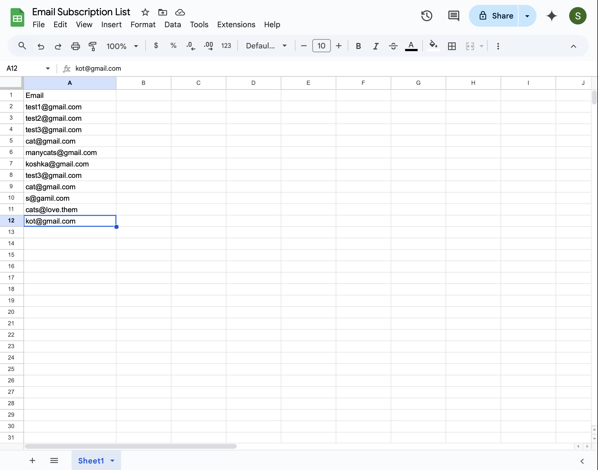

# 📧 Email Subscription Form With Google Sheets

This project is a simple **email subscription form** that collects user email addresses and stores them in **Google Sheets** using Google Apps Script. It features a clean and responsive design.

## 🚀 Features

- 📩 Collects email addresses via a subscription form.
- ☁️ Sends form data to **Google Sheets** securely.
- ✅ Displays a success message after submission.

## 📝 How It Works

1. The user enters their email in the input field.
2. The form sends the data to Google Sheets via a Google Apps Script.
3. A confirmation message appears, and the form resets.

## 🔗 Connecting to Google Sheets

1. Create a Google Sheet and go to **Extensions → Apps Script**.
2. Paste the following script:

```javascript
var sheetName = "Sheet1";
var scriptProp = PropertiesService.getScriptProperties();

function initialSetup() {
  var activeSpreadsheet = SpreadsheetApp.getActiveSpreadsheet();
  scriptProp.setProperty("key", activeSpreadsheet.getId());
}

function doPost(e) {
  var lock = LockService.getScriptLock();
  lock.tryLock(10000);

  try {
    var doc = SpreadsheetApp.openById(scriptProp.getProperty("key"));
    var sheet = doc.getSheetByName(sheetName);

    var headers = sheet.getRange(1, 1, 1, sheet.getLastColumn()).getValues()[0];
    var nextRow = sheet.getLastRow() + 1;

    var newRow = headers.map(function (header) {
      return header === "timestamp" ? new Date() : e.parameter[header];
    });

    sheet.getRange(nextRow, 1, 1, newRow.length).setValues([newRow]);

    return ContentService.createTextOutput(
      JSON.stringify({ result: "success", row: nextRow })
    ).setMimeType(ContentService.MimeType.JSON);
  } catch (e) {
    return ContentService.createTextOutput(
      JSON.stringify({ result: "error", error: e })
    ).setMimeType(ContentService.MimeType.JSON);
  } finally {
    lock.releaseLock();
  }
}
```

3. Click **File → Save Project**.
4. Go to **Deploy → New Deployment**.
5. Select **Web App**, set **Anyone can access**, and click **Deploy**.
6. Copy the deployment URL and replace `scriptURL` in `index.html` with it.

## 📌 Technologies Used

- HTML, CSS, JavaScript
- Google Apps Script
- Google Sheets API

## 📸 Demo Screenshots

### 1️⃣ Subscription Form With a Success Message


### 2️⃣ Final Result in Goggle Sheets


