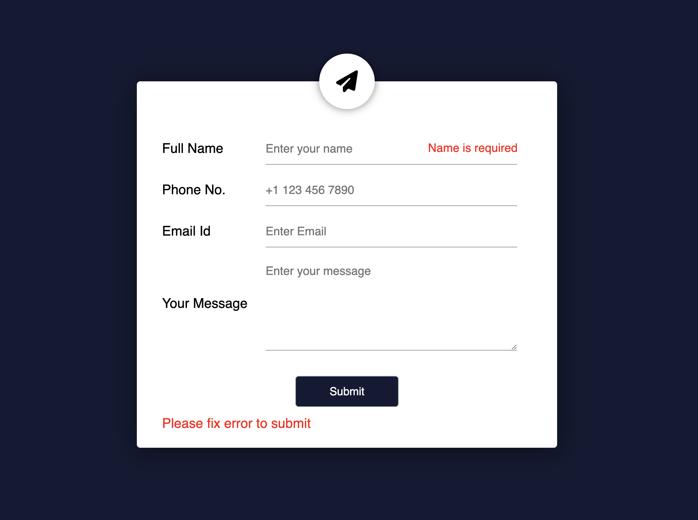
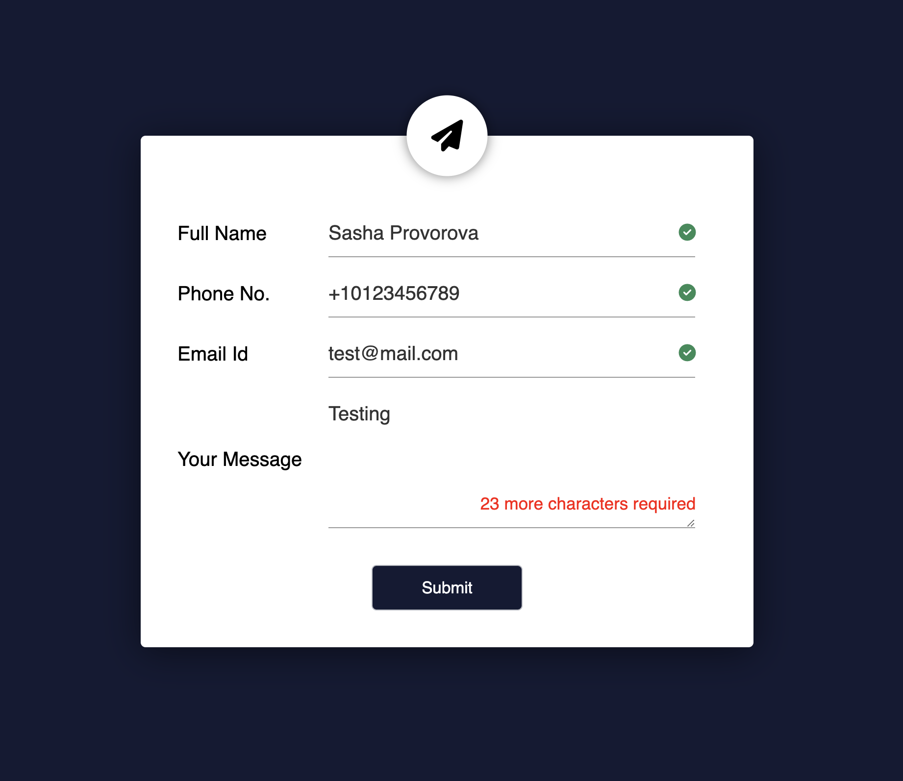

# Contact Form Validation

This script performs client-side validation for a contact form. The form contains four fields: **Full Name**, **Phone Number**, **Email Address**, and **Message**. The validation checks if the input meets specific criteria before submission, displaying error messages and success icons as feedback.

## Features

- **Full Name**: Requires a valid full name, composed of two words (first and last name).
- **Phone Number**: Requires a phone number starting with `+` followed by 11 digits (e.g., `+12345678901`).
- **Email Address**: Requires a valid email address (e.g., `user@example.com`).
- **Message**: Requires a message with a minimum length of 30 characters.

### Validation Logic

- **Name Validation**: Ensures that the name contains two words, with only letters and a space between them.
- **Phone Validation**: Ensures the phone number starts with a `+` followed by exactly 11 digits.
- **Email Validation**: Ensures the email follows a valid format (e.g., `user@example.com`).
- **Message Validation**: Ensures the message has at least 30 characters and shows a countdown of how many characters are left.

### Feedback

- If any field is invalid, an error message will appear below the corresponding field.
- A success icon (checkmark) will appear next to each valid input.
- A submission error message will appear if the form is not filled out correctly, and it will disappear after 3 seconds.

## Requirements

- **Font Awesome**: The success icon (checkmark) uses Font Awesome for displaying the icon. Make sure to include the Font Awesome script in your HTML.

## Installation

1. Download or clone this repository.
2. Include Font Awesome Kit ID in your HTML header, for example:

```html
<script
  src="https://kit.fontawesome.com/KitID.js"
  crossorigin="anonymous"
></script>
```

## Screenshot



