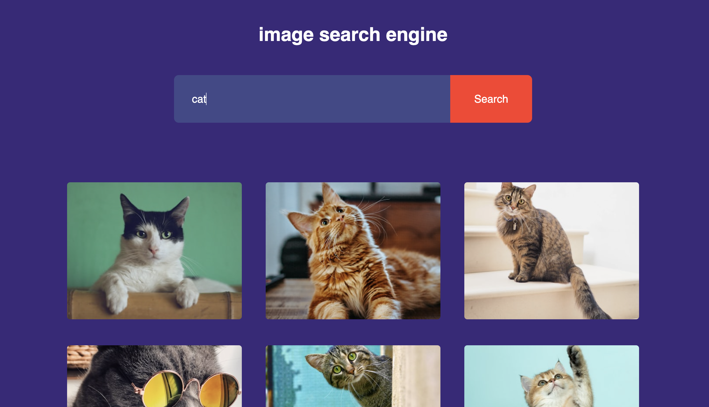
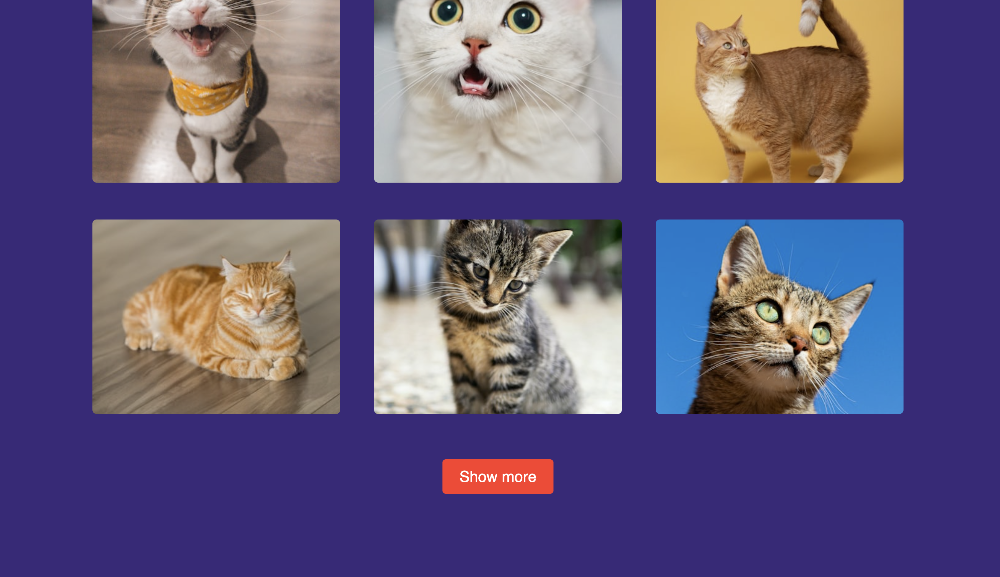

# 🔍 Image Search App

A simple image search application using the **Unsplash API**. Users can enter a keyword, fetch related images, and load more results dynamically.

## 🌐 Unsplash

🔗 [Link to Unsplash](https://unsplash.com)

## 🚀 Features

- 🔎 **Search for Images**: Fetches high-quality images from Unsplash.
- 📸 **Click to View**: Each image links to its Unsplash page.
- 🔄 **Load More**: Users can load additional images dynamically.

## 🏗️ Technologies Used

- **HTML**: Provides the structure of the web page.
- **CSS**: Styles the layout (if applicable).
- **JavaScript**: Handles API requests and DOM manipulation.
- **Unsplash API**: Fetches images based on user queries.

## 📸 Demo

  
  

