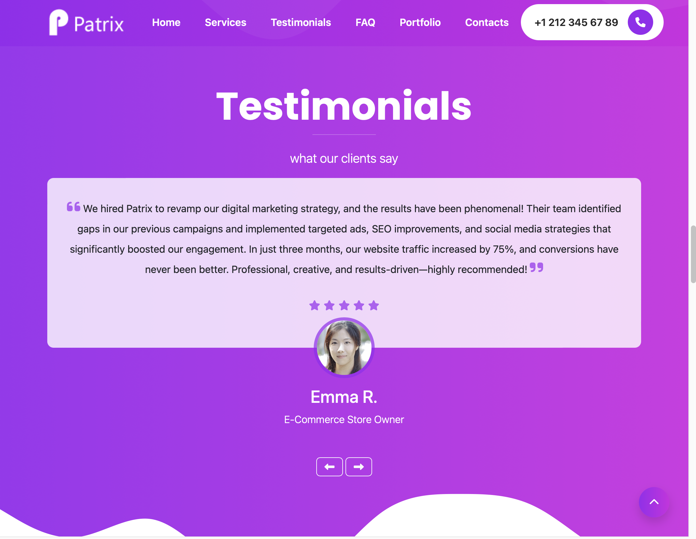
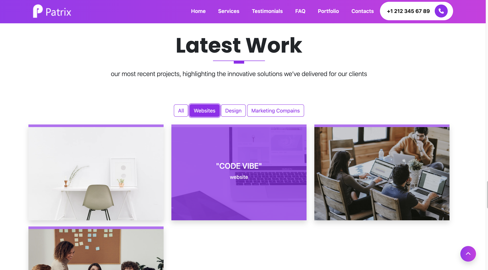
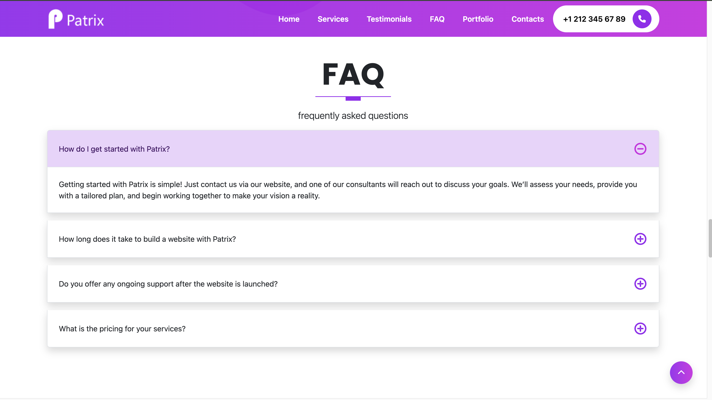

# 🚀 Patrix Business Landing Page

## 📖 Overview

This project is a **responsive** landing page designed to showcase **Patrix**’s marketing, web development, and cloud hosting services. Built with **Bootstrap 5**, **Sass**, **GLightbox**, and **FontAwesome 6**, the page is structured to be both modern and user-friendly, with components and sections neatly divided for easy customization. ✨

**Note**: **Patrix** is a **made-up company** created for the purpose of this project.

You can view the live page here: [Patrix Landing Page](https://superlative-tanuki-52a04c.netlify.app).

---

## 🛠 Features

- **Responsive Design** 📱💻: Adapts perfectly to all screen sizes using Bootstrap 5.
- **Bootstrap 5** ⚡: Utilizing the powerful grid system and components for fast and efficient design.
- **Sass** 🧩: Modular and maintainable CSS with mixins, variables, and partials.
- **GLightbox** ✨: Beautiful video lightbox feature to enhance the user experience.
- **FontAwesome 6** 🔥: Stylish icons to elevate the page's UI.
- **Custom JavaScript** 💻: Bootstrap handles most interactions, but one custom function was added to enhance the user experience.

---

## ✨ Custom JavaScript

Most of the JavaScript functionality is powered by Bootstrap, but I wrote one custom function for filtering and displaying relevant projects by click on a certain category.

---

## 📸  Image Demos

Here are some screenshots demonstrating key features of the landing page:

### 1. **Testimonials Section With Slides**

### 2. **Sort of Projects Into Categories**

### 3. **Accordion to Hide and Show Questions** 

