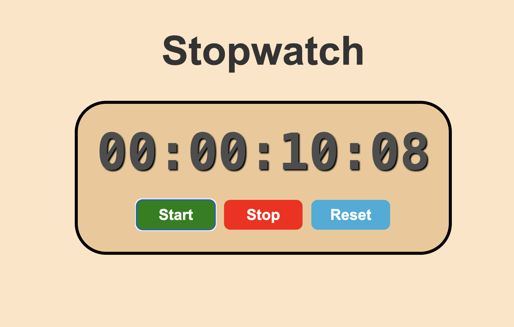

# ⏱️ Stopwatch

A simple stopwatch application built using **HTML, CSS, and JavaScript**. This stopwatch can **start, stop, and reset**, displaying the elapsed time in hours, minutes, seconds, and milliseconds.

## 📌 Features

✅ Start, stop, and reset the stopwatch  
✅ Displays time in `HH:MM:SS:MS` format  
✅ Updates every 10 milliseconds for high precision  
✅ Built using vanilla JavaScript (no libraries required)

## 📸 Demo

### Screenshot

