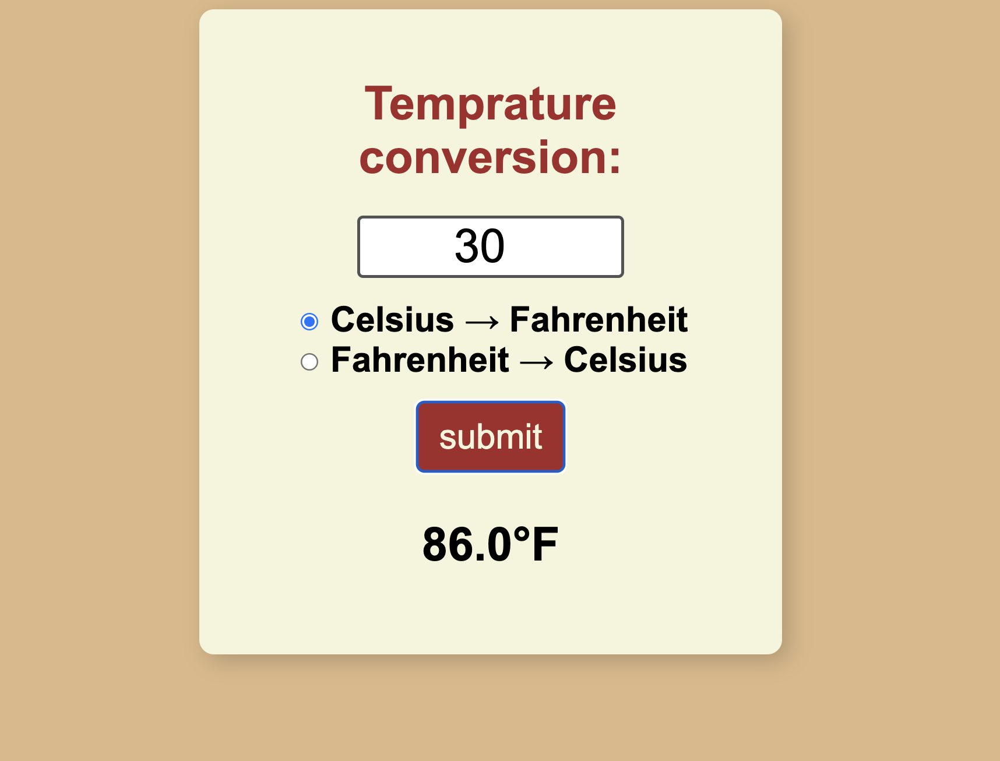
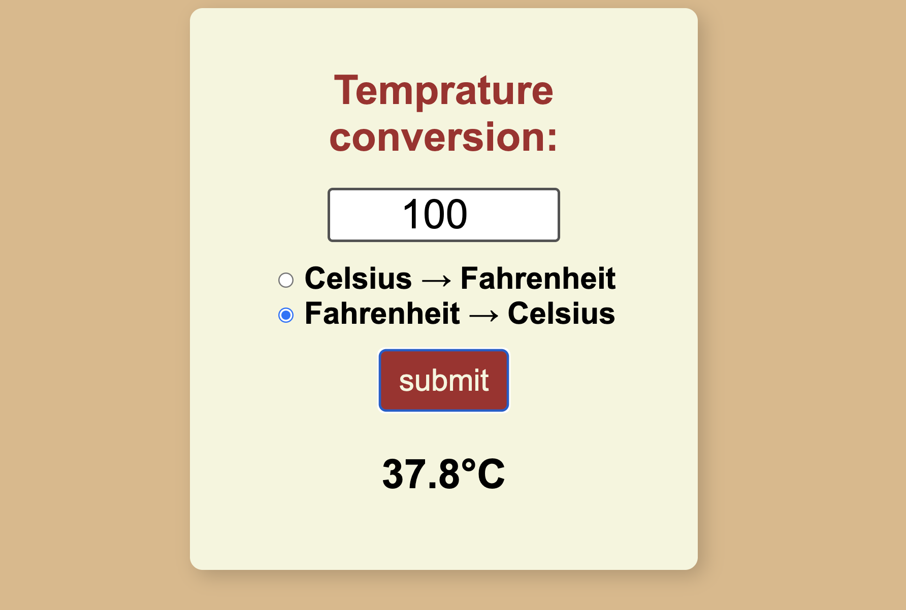

# Temperature Converter

A simple web-based temperature converter that allows users to convert temperatures between Celsius and Fahrenheit. The user can input a temperature value, select the conversion direction (Celsius to Fahrenheit or Fahrenheit to Celsius), and the result will be displayed.

## Features

- Convert temperatures from Celsius to Fahrenheit.
- Convert temperatures from Fahrenheit to Celsius.
- User-friendly interface with simple controls.

## How It Works

1. **User Input**: The user enters a temperature value in the input field.
2. **Unit Selection**: The user selects the desired conversion type using radio buttons (Celsius to Fahrenheit or Fahrenheit to Celsius).
3. **Conversion**: When the "submit" button is clicked, the JavaScript function `convert()` performs the conversion based on the selected unit.
4. **Result Display**: The result of the conversion is displayed below the button in the appropriate unit.

## Demo

Here are some screenshots:

