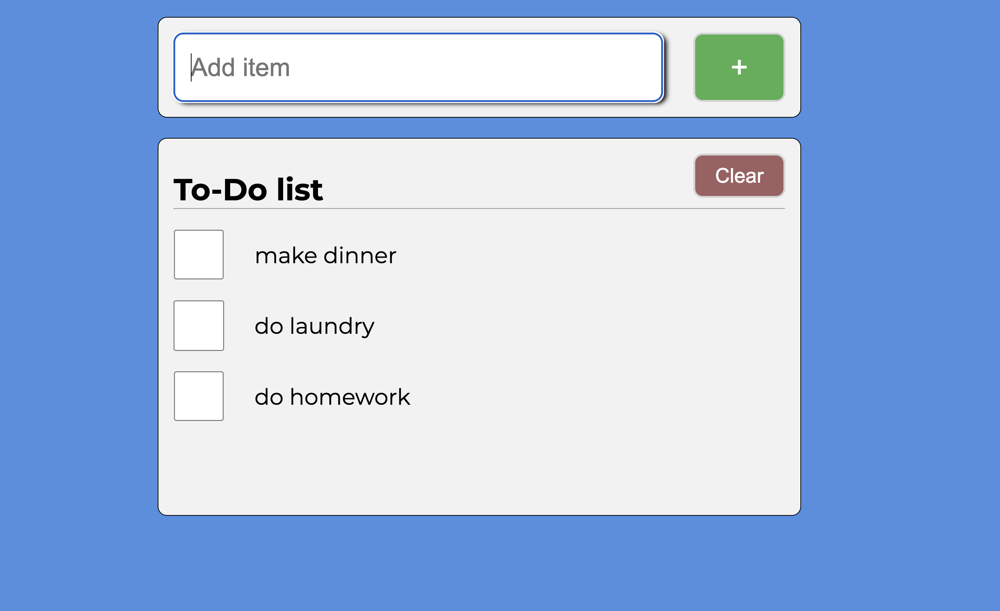
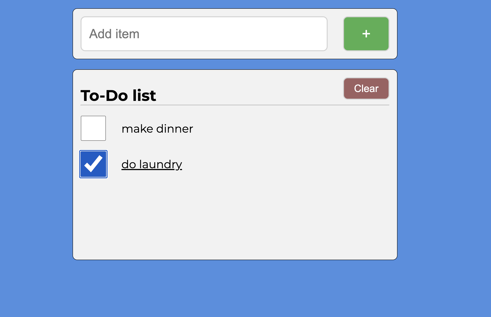
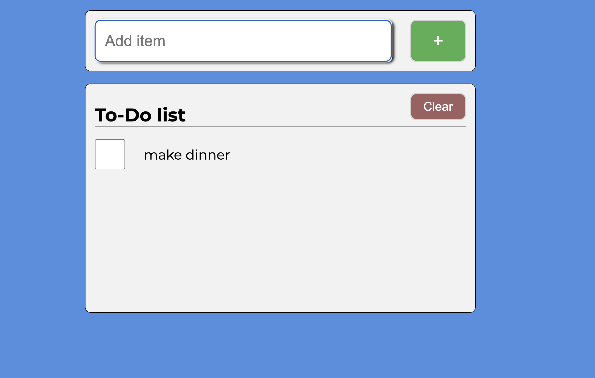

# To-Do List App

This is a simple **To-Do List App** that allows users to add, check off, and remove tasks. The app is built using **HTML, JavaScript (ES6 modules), and SASS** for styling. It also utilizes **localStorage** to persist tasks across page reloads.

## Features

- **Add Tasks**: Users can enter new tasks into the input field and add them to the list.
- **Check Off Tasks**: Completed tasks can be marked as done by clicking the checkbox.
- **Remove Tasks**: Checked tasks are automatically removed from the list.
- **Clear All Tasks**: Users can remove all tasks at once with a single button.
- **Local Storage**: The list is saved in the browser, so tasks persist after page reloads.
- **Accessible Design**: The app is designed with ARIA attributes and keyboard navigation in mind.

## Technologies Used

- **HTML5** for the structure.
- **SASS (SCSS)** for styling.
- **JavaScript (ES6 modules)** for app functionality.
- **LocalStorage** for data persistence.
- **Google Fonts** for typography.

## Screenshot

## How It Works

### Structure

The project consists of:

- A **form** to add new tasks.
- A **task list** where added tasks are displayed.
- A **clear button** to remove all tasks.
- Dynamic rendering of tasks in the UI using JavaScript.

### JavaScript Functionality

- **Event Listeners**: Handles task addition, removal, and clearing the list.
- **LocalStorage Handling**: Saves tasks and retrieves them on page load.
- **ES6 Classes**: `ToDoList` and `ToDoItem` classes manage task logic.

## Accessibility Features

- **Keyboard Navigable**: Users can navigate using the **Tab** key.
- **ARIA Labels**: Enhances screen reader compatibility.
- **Live Region Updates**: Provides audible feedback when tasks are added or removed.
