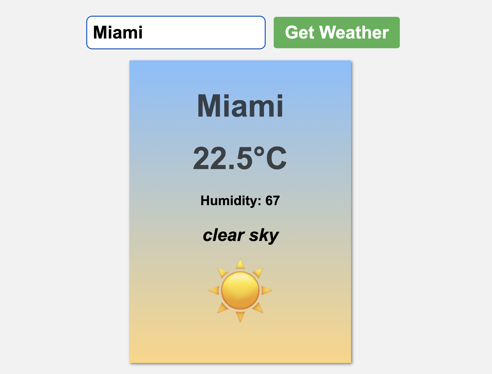
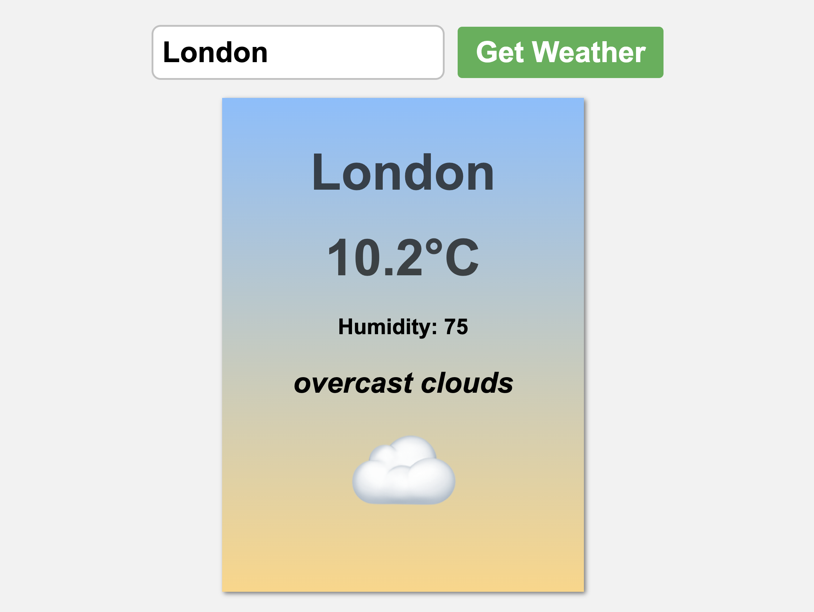

# Weather App

This is a simple **Weather App** that allows users to check the current weather conditions of a city. The app fetches weather data from the **OpenWeatherMap API** and displays the temperature, humidity, weather description, and a corresponding weather emoji.

## Features

- **City Input**: Enter the name of any city to retrieve the weather information.
- **Weather Details**: Displays the city name, temperature in Celsius, humidity, weather description, and an emoji corresponding to the weather conditions.
- **Error Handling**: Displays an error message if the city is invalid or if the weather data cannot be fetched.

## Screenshot

Here are screenshots of the Weather App:

## How It Works

### HTML Structure

The app consists of:

- A **form** with an input field for the city and a button to submit the request.
- A **card** where the weather information (city, temperature, humidity, description, and emoji) is displayed.

### JavaScript Functionality

- **Weather Fetching**: Upon submitting the city name, the app makes a `GET` request to the OpenWeatherMap API to fetch weather data.
- **Weather Display**: After fetching the weather data, it displays the city name, temperature in Celsius, humidity, weather description, and a corresponding weather emoji.
- **Error Handling**: If the city name is not found or there is any issue with the API request, the app shows an error message.

### API Used

- **OpenWeatherMap API**: The weather data is fetched using the OpenWeatherMap API, which requires an API key.

### Weather Emojis

The app displays different weather emojis based on the weather condition code received from the API, such as:

- ☀️ for clear skies
- 🌧️ for rain
- ❄️ for snow
- 🌫️ for fog
